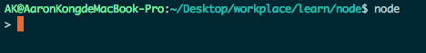

## Node 使用

### 第一个Node程序

在前面的所有章节中，我们编写的JavaScript代码都是在浏览器中运行的，因此，我们可以直接在浏览器中敲代码，然后直接运行。

从本章开始，我们编写的JavaScript代码将不能在浏览器环境中执行了，而是在Node环境中执行，因此，JavaScript代码将直接在你的计算机上以命令行的方式运行，所以，我们要先选择一个文本编辑器来编写JavaScript代码，并且把它保存到本地硬盘的某个目录，才能够执行。

那么问题来了：文本编辑器到底哪家强？

首先，请注意，绝对不能用Word和写字板。Word和写字板保存的不是纯文本文件。如果我们要用记事本来编写JavaScript代码，要务必注意，记事本以UTF-8格式保存文件时，会自作聪明地在文件开始的地方加上几个特殊字符（UTF-8 BOM），结果经常会导致程序运行出现莫名其妙的错误。

所以，用记事本写代码时请注意，保存文件时使用ANSI编码，并且暂时不要输入中文。

如果你的电脑上已经安装了Sublime Text，或者Notepad++，也可以用来编写JavaScript代码，注意用UTF-8格式保存。


输入以下代码：

```javascript
console.log('Hello, world.');
```

然后，选择一个目录，例如 `~/Desktop/workplace/learn/node` ，把文件保存为 `hello.js` ，就可以打开命令行窗口，把当前目录切换到 `hello.js` 所在目录，然后输入以下命令运行这个程序了：

``` shell
$ node hello.js
Hello, world.
```


### Node交互式模式

在终端命令行模式下，可以执行 `node` 进入Node交互式模式：



在Node交互式环境下，我们可以输入JavaScript代码并立刻执行。

此外，在命令行模式运行.js文件和在Node交互式环境下直接运行JavaScript代码有所不同。Node交互式环境会把每一行JavaScript代码的结果自动打印出来，但是，直接运行JavaScript文件却不会。

例如，在Node交互式环境下，输入：

``` shell
> 100 + 200 + 300;
600
```


### 小结

1. 用文本编辑器写JavaScript程序，然后保存为后缀为.js的文件，就可以用node直接运行这个程序了。

2. Node的交互模式和直接运行.js文件有什么区别呢？

3. 直接输入node进入交互模式，相当于启动了Node解释器，但是等待你一行一行地输入源代码，每输入一行就执行一行。

4. 直接运行node hello.js文件相当于启动了Node解释器，然后一次性把hello.js文件的源代码给执行了，你是没有机会以交互的方式输入源代码的。
