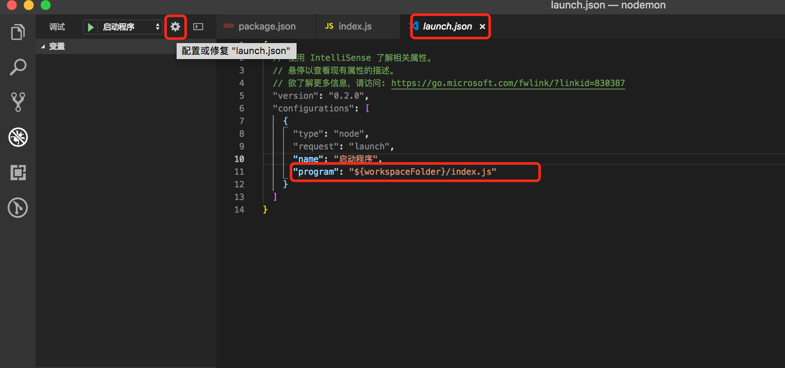

# Vscode debugger

## 调试node

1.进入VScode界面，点击界面左边的第四个类似虫子的按钮，进入调试界面：

2.点击页面上方“没有配置”下拉菜单，选择“添加配置”

3.选择Node.js环境

4.选择完成之后，在项目的根目录中会生成一个.vscode的目录，这个目录中存放了各种各样的VScode编辑器的配置。现在这个目录中就包含了一个文件名为lanuch.json的配置文件，配置文件的内容如下：

5.也可直接点击debugger界面‘设置’图标

6.启动debugger 出现debugger工具

7.我们再次在浏览中访问localhost:3000，会发现页面可以打开，应用已经正常启动了

8.在需要调试的代码处设置断点

7.刷新浏览器，进入断点
